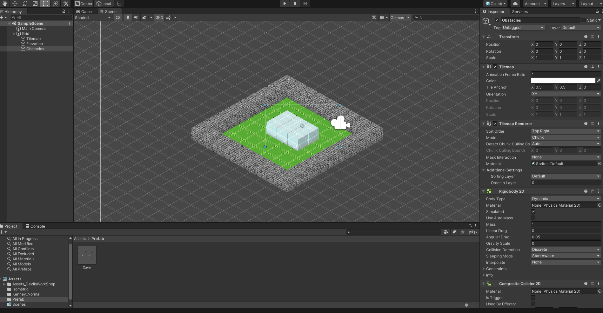

# Práctica FDV Tilemaps #

## Actividades a realizar:

### 1.Obtener assets que incorpores a tu proyecto para la generación del mapa: planos e isométricos.

### 2.Incorporar los recursos del punto 1 en el proyecto y generar al menos 2 paletas, para cada uno de los dos tipos de mapas.

### 3.Generar un mapa convencional, incluir obstáculos y paredes.

### 4.Generar un mapa isométrico, generar zonas elevadas y obstáculos.
